# 🚀 Angular 15 — Zero to Hero Learning Roadmap

Your project: `d:\Work\ProjectCode\ng-app` (Angular 15.2, TypeScript 4.9)

---

## Phase 0: Prerequisites

Before diving into Angular, make sure you're comfortable with these:

| Topic | What to Know | Resource |
|-------|-------------|----------|
| **HTML/CSS** | Structure, selectors, flexbox, grid | [MDN Docs](https://developer.mozilla.org/en-US/docs/Web/HTML) |
| **JavaScript ES6+** | `let/const`, arrow functions, destructuring, promises, `async/await`, modules (`import/export`) | [javascript.info](https://javascript.info/) |
| **TypeScript Basics** | Types, interfaces, classes, generics, decorators | [TypeScript Handbook](https://www.typescriptlang.org/docs/handbook/) |
| **Node.js & npm** | `npm install`, `package.json`, scripts | Already in use! |

> [!TIP]
> You can skip this phase if you already know these topics. But **TypeScript** is critical — Angular is built on it.

---

## Phase 1: Angular Fundamentals ⭐

### 1.1 How Angular Works


**Key files in your project:**

| File | Purpose |
|------|---------|
| [main.ts](file:///d:/Work/ProjectCode/ng-app/src/main.ts) | Entry point — bootstraps `AppModule` |
| [app.module.ts](file:///d:/Work/ProjectCode/ng-app/src/app/app.module.ts) | Root module — registers components & imports |
| [app.component.ts](file:///d:/Work/ProjectCode/ng-app/src/app/app.component.ts) | Root component — the shell of your app |
| [app-routing.module.ts](file:///d:/Work/ProjectCode/ng-app/src/app/app-routing.module.ts) | Routing configuration |

### 1.2 Components — The Building Blocks

A component = **class** + **decorator** + **template** + **styles**

```typescript
// Example: src/app/component/header/header.component.ts
import { Component } from '@angular/core';

@Component({
  selector: 'app-header',       // HTML tag name
  templateUrl: './header.component.html',  // view
  styleUrls: ['./header.component.css']    // styles
})
export class HeaderComponent {
  title = 'My App';   // property (data)

  greet() {            // method (behavior)
    alert('Hello!');
  }
}
```

**Generate a new component:**
```bash
ng generate component component/footer
# shorthand: ng g c component/footer
```

### 1.3 Templates & Data Binding

Angular has 4 types of data binding:

| Type | Syntax | Direction | Example |
|------|--------|-----------|---------|
| **Interpolation** | `{{ }}` | Component → View | `<h1>{{ title }}</h1>` |
| **Property Binding** | `[property]` | Component → View | `` |
| **Event Binding** | `(event)` | View → Component | `<button (click)="save()">` |
| **Two-Way Binding** | `[(ngModel)]` | Both ways | `<input [(ngModel)]="name">` |

```html
<!-- Example template -->
<h1>{{ title }}</h1>
<p>Welcome, {{ username }}!</p>
<button (click)="greet()">Say Hello</button>
<input [(ngModel)]="username" placeholder="Enter name">
```

> [!IMPORTANT]
> To use `[(ngModel)]`, you must import `FormsModule` in your `app.module.ts`:
> ```typescript
> import { FormsModule } from '@angular/forms';
> @NgModule({ imports: [BrowserModule, FormsModule, AppRoutingModule] })
> ```

### 1.4 Directives

| Directive | Purpose | Example |
|-----------|---------|---------|
| `*ngIf` | Conditionally show/hide | `<p *ngIf="isLoggedIn">Welcome!</p>` |
| `*ngFor` | Loop over a list | `<li *ngFor="let item of items">{{ item }}</li>` |
| `[ngClass]` | Dynamic CSS classes | `<div [ngClass]="{'active': isActive}">` |
| `[ngStyle]` | Dynamic inline styles | `<div [ngStyle]="{'color': textColor}">` |
| `*ngSwitch` | Switch/case in template | See example below |

```html
<!-- *ngFor with index -->
<ul>
  <li *ngFor="let user of users; let i = index">
    {{ i + 1 }}. {{ user.name }} — {{ user.email }}
  </li>
</ul>

<!-- *ngIf with else -->
<div *ngIf="users.length > 0; else noUsers">
  <p>Found {{ users.length }} users</p>
</div>
<ng-template #noUsers>
  <p>No users found.</p>
</ng-template>
```

### ✅ Exercise 1: Build a Todo List

Create a `TodoComponent` with:
- An input field + button to add items
- Display the list using `*ngFor`
- A delete button on each item
- Show "No todos yet" when the list is empty using `*ngIf`

```bash
ng g c component/todo
```

---

## Phase 2: Component Communication 🔗

### 2.1 Parent → Child: `@Input()`

```typescript
// child.component.ts
import { Component, Input } from '@angular/core';

@Component({
  selector: 'app-child',
  template: `<p>Hello, {{ name }}!</p>`
})
export class ChildComponent {
  @Input() name: string = '';
}
```
```html
<!-- parent.component.html -->
<app-child [name]="parentName"></app-child>
```

### 2.2 Child → Parent: `@Output()` + EventEmitter

```typescript
// child.component.ts
import { Component, Output, EventEmitter } from '@angular/core';

@Component({
  selector: 'app-child',
  template: `<button (click)="sendMessage()">Send</button>`
})
export class ChildComponent {
  @Output() messageEvent = new EventEmitter<string>();

  sendMessage() {
    this.messageEvent.emit('Hello from child!');
  }
}
```
```html
<!-- parent.component.html -->
<app-child (messageEvent)="receiveMessage($event)"></app-child>
<p>{{ message }}</p>
```

### 2.3 Communication Diagram

```mermaid
graph LR
    P["Parent Component"] -- "@Input() ➡️" --> C["Child Component"]
    C -- "@Output() ⬅️" --> P
    P -- "ViewChild" --> C
    S["Shared Service"] <--> P
    S <--> C
```



### ✅ Exercise 2: Product Card

1. Create a `ProductCardComponent` that accepts `@Input()` for `name`, `price`, `image`
2. Add an "Add to Cart" button that emits an `@Output()` event
3. In the parent, display a list of product cards and track the cart count

---

## Phase 3: Services & Dependency Injection 💉

### 3.1 What Are Services?

Services hold **shared logic** (data fetching, calculations, state) that multiple components need.

```bash
ng generate service services/user
```

```typescript
// services/user.service.ts
import { Injectable } from '@angular/core';

@Injectable({
  providedIn: 'root'  // available app-wide (singleton)
})
export class UserService {
  private users: string[] = ['Alice', 'Bob', 'Charlie'];

  getUsers(): string[] {
    return this.users;
  }

  addUser(name: string): void {
    this.users.push(name);
  }
}
```

### 3.2 Injecting a Service

```typescript
// some.component.ts
import { Component, OnInit } from '@angular/core';
import { UserService } from '../services/user.service';

@Component({ /* ... */ })
export class SomeComponent implements OnInit {
  users: string[] = [];

  constructor(private userService: UserService) {}  // DI magic!

  ngOnInit() {
    this.users = this.userService.getUsers();
  }
}
```

### ✅ Exercise 3: Shared Cart Service

1. Create `CartService` with methods: `addItem()`, `removeItem()`, `getItems()`, `getTotal()`
2. Inject it into both `ProductCard` and a new `CartSummary` component
3. Both components reflect the same cart state

---

## Phase 4: Routing & Navigation 🗺️

### 4.1 Setting Up Routes

```typescript
// app-routing.module.ts
import { NgModule } from '@angular/core';
import { RouterModule, Routes } from '@angular/router';
import { HomeComponent } from './component/home/home.component';
import { AboutComponent } from './component/about/about.component';
import { NotFoundComponent } from './component/not-found/not-found.component';

const routes: Routes = [
  { path: '', component: HomeComponent },
  { path: 'about', component: AboutComponent },
  { path: 'user/:id', component: UserDetailComponent },  // route params
  { path: '**', component: NotFoundComponent }  // wildcard (404)
];

@NgModule({
  imports: [RouterModule.forRoot(routes)],
  exports: [RouterModule]
})
export class AppRoutingModule { }
```

### 4.2 Navigation

```html
<!-- Template-based navigation -->
<nav>
  <a routerLink="/" routerLinkActive="active">Home</a>
  <a routerLink="/about" routerLinkActive="active">About</a>
  <a [routerLink]="['/user', userId]">Profile</a>
</nav>

<!-- This is WHERE routed components render -->
<router-outlet></router-outlet>
```

```typescript
// Programmatic navigation
import { Router } from '@angular/router';

constructor(private router: Router) {}

goToUser(id: number) {
  this.router.navigate(['/user', id]);
}
```

### 4.3 Reading Route Parameters

```typescript
import { ActivatedRoute } from '@angular/router';

constructor(private route: ActivatedRoute) {}

ngOnInit() {
  // Snapshot (one-time read)
  const id = this.route.snapshot.paramMap.get('id');

  // Observable (reacts to changes)
  this.route.paramMap.subscribe(params => {
    this.userId = params.get('id');
  });
}
```

### ✅ Exercise 4: Multi-Page App

1. Create `Home`, `About`, `Contact`, `NotFound` components
2. Set up routes in `app-routing.module.ts`
3. Add a navigation bar in `HeaderComponent` with `routerLink`
4. Add `<router-outlet>` in `AppComponent`
5. Highlight the active link with `routerLinkActive`

---

## Phase 5: Forms 📝

### 5.1 Template-Driven Forms (simpler)

```typescript
// Requires FormsModule in app.module.ts
import { FormsModule } from '@angular/forms';
```
```html
<form #myForm="ngForm" (ngSubmit)="onSubmit(myForm)">
  <input name="email" ngModel required email placeholder="Email">
  <input name="password" ngModel required minlength="6" placeholder="Password">

  <div *ngIf="myForm.controls['email']?.invalid && myForm.controls['email']?.touched">
    Please enter a valid email.
  </div>

  <button [disabled]="myForm.invalid">Submit</button>
</form>
```

### 5.2 Reactive Forms (more powerful) ⭐

```typescript
// Requires ReactiveFormsModule in app.module.ts
import { ReactiveFormsModule } from '@angular/forms';
```
```typescript
import { Component } from '@angular/core';
import { FormBuilder, FormGroup, Validators } from '@angular/forms';

@Component({ /* ... */ })
export class LoginComponent {
  loginForm: FormGroup;

  constructor(private fb: FormBuilder) {
    this.loginForm = this.fb.group({
      email:    ['', [Validators.required, Validators.email]],
      password: ['', [Validators.required, Validators.minLength(6)]]
    });
  }

  onSubmit() {
    if (this.loginForm.valid) {
      console.log(this.loginForm.value);
      // { email: '...', password: '...' }
    }
  }
}
```
```html
<form [formGroup]="loginForm" (ngSubmit)="onSubmit()">
  <input formControlName="email" placeholder="Email">
  <div *ngIf="loginForm.get('email')?.hasError('required') &&
              loginForm.get('email')?.touched">
    Email is required.
  </div>

  <input formControlName="password" type="password" placeholder="Password">
  <button [disabled]="loginForm.invalid">Login</button>
</form>
```

### ✅ Exercise 5: Registration Form

Build a registration form with **Reactive Forms**:
- Fields: `username`, `email`, `password`, `confirmPassword`
- Validation: all required, email format, password min 8 chars
- Custom validator: `password` must match `confirmPassword`
- Show validation errors below each field

---

## Phase 6: HTTP & APIs 🌐

### 6.1 Setup `HttpClientModule`

```typescript
// app.module.ts
import { HttpClientModule } from '@angular/common/http';

@NgModule({
  imports: [BrowserModule, HttpClientModule, ...]
})
```

### 6.2 Making HTTP Requests

```typescript
import { Injectable } from '@angular/core';
import { HttpClient } from '@angular/common/http';
import { Observable } from 'rxjs';

interface User {
  id: number;
  name: string;
  email: string;
}

@Injectable({ providedIn: 'root' })
export class ApiService {
  private apiUrl = 'https://jsonplaceholder.typicode.com';

  constructor(private http: HttpClient) {}

  getUsers(): Observable<User[]> {
    return this.http.get<User[]>(`${this.apiUrl}/users`);
  }

  getUser(id: number): Observable<User> {
    return this.http.get<User>(`${this.apiUrl}/users/${id}`);
  }

  createUser(user: Partial<User>): Observable<User> {
    return this.http.post<User>(`${this.apiUrl}/users`, user);
  }

  updateUser(id: number, user: Partial<User>): Observable<User> {
    return this.http.put<User>(`${this.apiUrl}/users/${id}`, user);
  }

  deleteUser(id: number): Observable<void> {
    return this.http.delete<void>(`${this.apiUrl}/users/${id}`);
  }
}
```

### 6.3 Using in Components

```typescript
export class UserListComponent implements OnInit {
  users: User[] = [];
  loading = true;
  error = '';

  constructor(private api: ApiService) {}

  ngOnInit() {
    this.api.getUsers().subscribe({
      next: (data) => { this.users = data; this.loading = false; },
      error: (err) => { this.error = 'Failed to load'; this.loading = false; }
    });
  }
}
```

### ✅ Exercise 6: User Directory

1. Create an `ApiService` that fetches from `https://jsonplaceholder.typicode.com/users`
2. Build a `UserListComponent` that displays users in a table
3. Click a user → navigate to `UserDetailComponent` (route param `:id`)
4. Show loading spinner & error handling

---

## Phase 7: RxJS Essentials 🔄

### Key Operators You Must Know

| Operator | Purpose | Example Use Case |
|----------|---------|-----------------|
| `map` | Transform data | Convert API response format |
| `filter` | Filter emissions | Only process valid values |
| `tap` | Side effects (logging) | Debug observables |
| `switchMap` | Cancel previous, use latest | Search-as-you-type |
| `debounceTime` | Wait before emitting | Search input delay |
| `catchError` | Handle errors | API error fallback |
| `combineLatest` | Combine multiple streams | Multiple data sources |
| `Subject` | Multicast observable | Event bus between components |

### Practical Example: Search with Debounce

```typescript
import { Subject } from 'rxjs';
import { debounceTime, distinctUntilChanged, switchMap } from 'rxjs/operators';

export class SearchComponent implements OnInit {
  searchTerms = new Subject<string>();
  results: User[] = [];

  constructor(private api: ApiService) {}

  ngOnInit() {
    this.searchTerms.pipe(
      debounceTime(300),           // wait 300ms after typing stops
      distinctUntilChanged(),       // ignore if same as previous
      switchMap(term => this.api.searchUsers(term))  // cancel previous request
    ).subscribe(results => this.results = results);
  }

  onSearch(term: string) {
    this.searchTerms.next(term);
  }
}
```

### ✅ Exercise 7: Live Search

Build a search component that:
- Takes user input and searches the JSONPlaceholder API
- Uses `debounceTime` (300ms) + `switchMap`
- Shows results in real-time
- Handles loading and empty states

---

## Phase 8: Lifecycle Hooks, Pipes & More 🔧

### 8.1 Component Lifecycle Hooks


| Hook | When It Runs | Common Use |
|------|-------------|------------|
| `ngOnInit` | After first `@Input` set | Fetch data, initialize |
| `ngOnChanges` | When `@Input` values change | React to input changes |
| `ngOnDestroy` | Before component is removed | Unsubscribe, cleanup |
| `ngAfterViewInit` | After view is rendered | Access DOM elements |

### 8.2 Pipes (Transform Display Data)

```html
<!-- Built-in pipes -->
{{ today | date:'fullDate' }}           <!-- Monday, February 18, 2026 -->
{{ price | currency:'USD' }}            <!-- $29.99 -->
{{ name | uppercase }}                  <!-- JOHN -->
{{ longText | slice:0:100 }}            <!-- First 100 chars -->
{{ user | json }}                       <!-- Debug: show object as JSON -->
```

**Custom Pipe:**
```bash
ng g pipe pipes/truncate
```
```typescript
import { Pipe, PipeTransform } from '@angular/core';

@Pipe({ name: 'truncate' })
export class TruncatePipe implements PipeTransform {
  transform(value: string, limit: number = 50): string {
    return value.length > limit ? value.substring(0, limit) + '...' : value;
  }
}
```
```html
<p>{{ longDescription | truncate:80 }}</p>
```

---

## Phase 9: Modules, Lazy Loading & Guards 🏗️

### 9.1 Feature Modules

```bash
ng g module features/admin --routing
ng g component features/admin/dashboard
ng g component features/admin/settings
```

### 9.2 Lazy Loading (Load only when needed)

```typescript
// app-routing.module.ts
const routes: Routes = [
  { path: '', component: HomeComponent },
  {
    path: 'admin',
    loadChildren: () => import('./features/admin/admin.module')
      .then(m => m.AdminModule)
  }
];
```

### 9.3 Route Guards

```bash
ng g guard guards/auth
```
```typescript
import { Injectable } from '@angular/core';
import { CanActivate, Router } from '@angular/router';

@Injectable({ providedIn: 'root' })
export class AuthGuard implements CanActivate {
  constructor(private router: Router) {}

  canActivate(): boolean {
    const isLoggedIn = !!localStorage.getItem('token');
    if (!isLoggedIn) {
      this.router.navigate(['/login']);
      return false;
    }
    return true;
  }
}
```
```typescript
// Usage in routes
{ path: 'admin', component: AdminComponent, canActivate: [AuthGuard] }
```

### ✅ Exercise 9: Admin Module

1. Create a lazy-loaded `AdminModule` with `Dashboard` and `Settings` pages
2. Create an `AuthGuard` that checks for a token in `localStorage`
3. Protect the `/admin` route with the guard

---

## Phase 10: Advanced Topics 🎓

### 10.1 Interceptors (Modify Every HTTP Request)

```typescript
import { Injectable } from '@angular/core';
import { HttpInterceptor, HttpRequest, HttpHandler } from '@angular/common/http';

@Injectable()
export class AuthInterceptor implements HttpInterceptor {
  intercept(req: HttpRequest<any>, next: HttpHandler) {
    const token = localStorage.getItem('token');
    if (token) {
      req = req.clone({
        setHeaders: { Authorization: `Bearer ${token}` }
      });
    }
    return next.handle(req);
  }
}
```

### 10.2 Environment Files

```typescript
// src/environments/environment.ts (dev)
export const environment = {
  production: false,
  apiUrl: 'http://localhost:3000/api'
};

// src/environments/environment.prod.ts
export const environment = {
  production: true,
  apiUrl: 'https://api.myapp.com'
};
```

### 10.3 State Management Patterns

For small apps  → **Services with BehaviorSubject**
For medium apps → **NgRx Component Store**
For large apps  → **NgRx Store** (Redux pattern)

```typescript
// Simple state with BehaviorSubject
@Injectable({ providedIn: 'root' })
export class StateService {
  private countSubject = new BehaviorSubject<number>(0);
  count$ = this.countSubject.asObservable();

  increment() { this.countSubject.next(this.countSubject.value + 1); }
  decrement() { this.countSubject.next(this.countSubject.value - 1); }
}
```

---

## 📋 Learning Checklist (Suggested Order)

| # | Topic | Phase | Priority |
|---|-------|-------|----------|
| 1 | TypeScript basics | 0 | 🔴 Must |
| 2 | Components & templates | 1 | 🔴 Must |
| 3 | Data binding (interpolation, property, event, two-way) | 1 | 🔴 Must |
| 4 | Directives (`*ngIf`, `*ngFor`, `ngClass`) | 1 | 🔴 Must |
| 5 | `@Input()` / `@Output()` | 2 | 🔴 Must |
| 6 | Services & Dependency Injection | 3 | 🔴 Must |
| 7 | Routing & Navigation | 4 | 🔴 Must |
| 8 | Template-driven Forms | 5 | 🟡 Important |
| 9 | Reactive Forms | 5 | 🔴 Must |
| 10 | HTTP Client & APIs | 6 | 🔴 Must |
| 11 | RxJS basics (`map`, `subscribe`, `pipe`) | 7 | 🔴 Must |
| 12 | RxJS operators (`switchMap`, `debounceTime`) | 7 | 🟡 Important |
| 13 | Lifecycle hooks | 8 | 🟡 Important |
| 14 | Pipes (built-in & custom) | 8 | 🟡 Important |
| 15 | Feature modules & lazy loading | 9 | 🟡 Important |
| 16 | Route guards | 9 | 🟡 Important |
| 17 | HTTP Interceptors | 10 | 🟢 Nice to have |
| 18 | State management | 10 | 🟢 Nice to have |

---

## 🛠️ Useful CLI Commands

```bash
ng serve                          # Run dev server (http://localhost:4200)
ng generate component <name>      # Create component (ng g c <name>)
ng generate service <name>        # Create service  (ng g s <name>)
ng generate module <name>         # Create module   (ng g m <name>)
ng generate pipe <name>           # Create pipe     (ng g p <name>)
ng generate guard <name>          # Create guard    (ng g g <name>)
ng build                          # Build for production
ng test                           # Run unit tests
```

## 📚 Recommended Resources

- [Angular Official Docs (v15)](https://v15.angular.io/docs)
- [Angular Official Tutorial](https://v15.angular.io/tutorial)
- [RxJS Documentation](https://rxjs.dev/)
- [TypeScript Handbook](https://www.typescriptlang.org/docs/handbook/)
